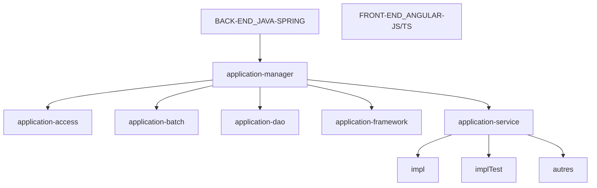

# Exercice 1

## Ce que je peux identifer dans mon entreprise actuelle →

- ### Quelles sont les silots ?

```
Dans l'entreprise où je suis en alternance actuellement, nous partageons un openspace qui est structuré selon les différents corps de métier.

L'openspace est principalement coupé en deux rangs. 
Le rang de gauche est réservé à la partie Fabrication.

Le rang de droite est pour la partie Architecture et Devops.

Dans les extrémités des rangs, se trouvent des bureaux vitrés où il y a les rh d'un côté, et les administrateurs système de l'autre côté.

A l'étage d'en dessous nous avons les gestionnaires.

La partie fabrication est composées de plusieurs équipes par projet.
```
```
Je suis dans la partie fabrication qui est composée de →
```

+ Développeurs frontend
+ Développeurs backend
+ Développeurs full-stack
+ Développeurs PLSQL
+ Développeurs qui tournent dans la recette (réparation de bugs si j'ai bien compris).

- ### _Quelles sont les pratiques devops ?_

Dans l'entreprise on utilise une méthode agile avec des sprints.
Pour le côté devops, ils n'utilisent pas encore Docker, ou à petite dose, iks sont toujours sur une machine virtuelle parce que le logiciel de l'entreprise est ancien et que ça serait trop compliquer de passer à Docker et demanderais beaucoup de temps si j'ai bien compris.
Ils récupèrent des packages, je pense que c'est ça qu'ils déploient.

- ### _Schéma d'architecture global →_

Je fais selon ce que j'ai compris, et pour le moment je n'utilise qu'une partie du back dans l'entreprise, le service.



- ### _Quel est le processus de build ?_

- ### _Quel est le processus de déploiement ?_

- ### _Quel est le processus de release_

- ### _Quelles sont les moyens mis en oeuvre pour les tests ?_

+ Tests Unitaires
+ Tests d'intégrations ...

## Les points de blocages que j'ai pu identifier et les bons points dans mon entreprise →

## Les outils utilisés dans l'entreprise →

+ Jira
+ Sonarcube
+ Sonarlint
+ Gitlab
+ Sharepoint
+ Teams
+ Outlook
+ Kelio
+ Ronspot

